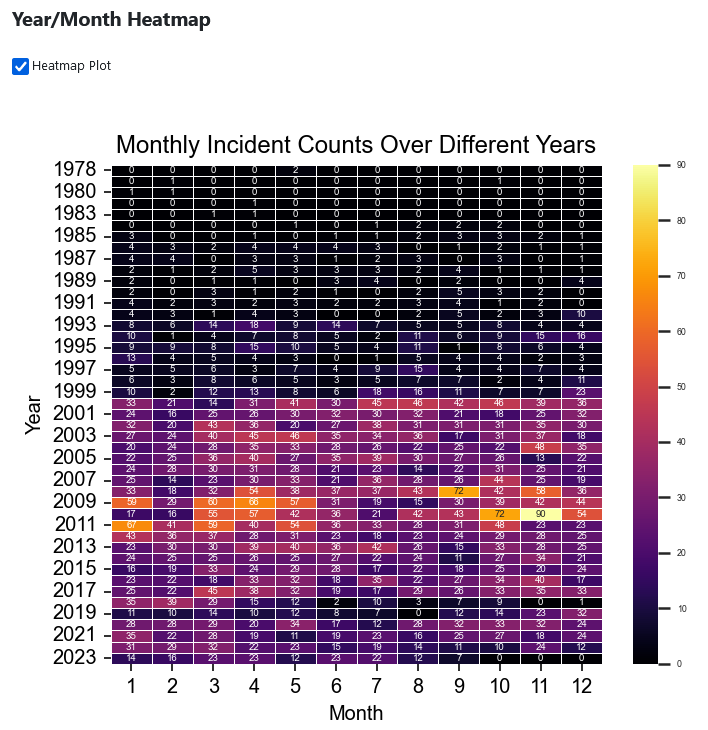
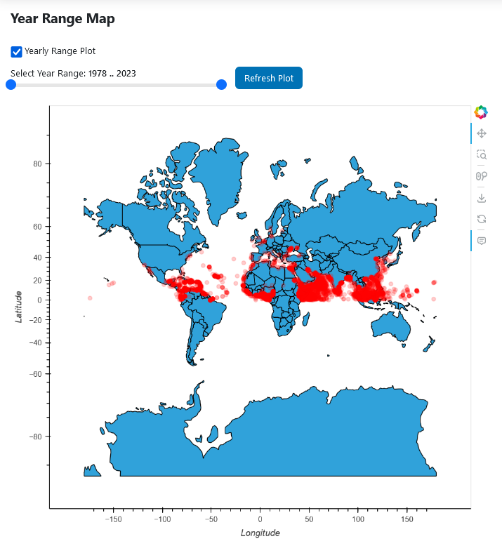
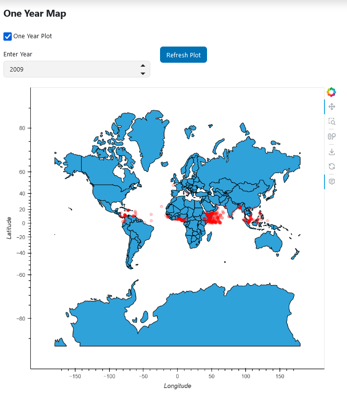
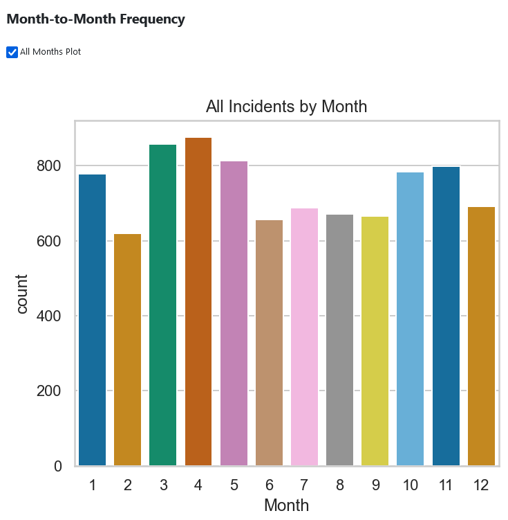
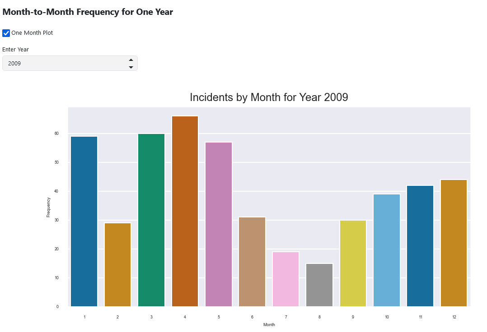
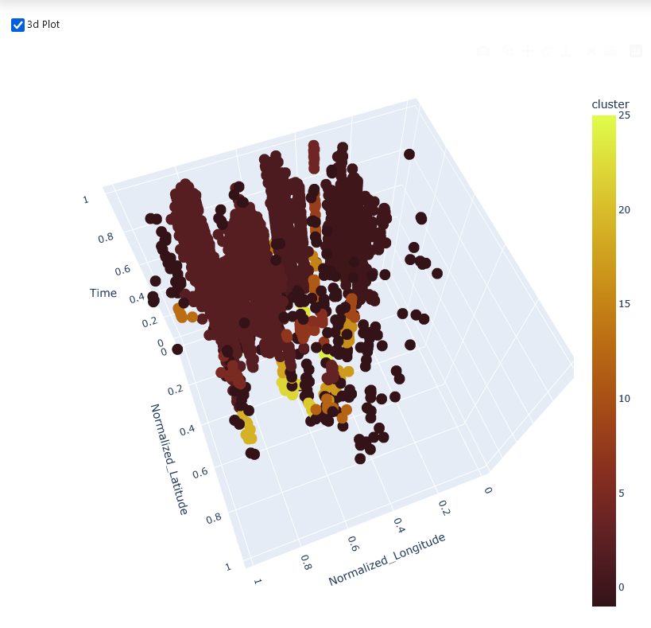

Features
=========

Year/Month Heatmap
--------------------
Shows a heatmap of the frequency of incidents by year (row) and month (column).

**Requires:** latitude_column, longitude_column

**Added with:** `"month_year_heatmap": true`

Year Range Map
---------------
Shows the incidents on a world map, with the years shown selected by a range.

**Requires:** latitude_column, longitude_column, time_column

**Added with:** `"yearly_range": true`

One Year Map
--------------
Same as Year Range Map, but for one year at a time.

**Requires:** latitude_column, longitude_column, time_column

**Added with:** `"one_year":true`

Month-to-Month Frequency
-------------------------
Histogram showing the frequency per month across all data points.

**Requires:** time_column

**Added with:** `"all_months":true`

Month-to-Month Frequency for One Year
----------------------------------------
Month-to-Month Frequency, but for one year at a time.

**Requires:** time_column

**Added with:** `"one_year_months":true`

Latitude/Longitude/Time 3D Visualization
-------------------------------------------
A 3D visualization of the data. Latitude, longitude, and time are each a dimension.

**Requires:** time_column

**Added with:** `"threeD":true`

