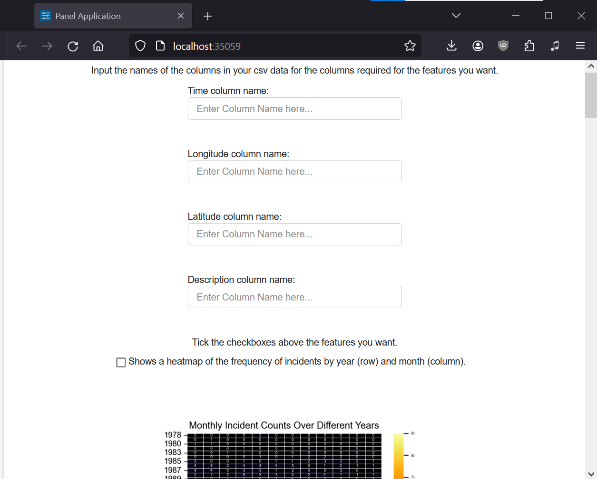
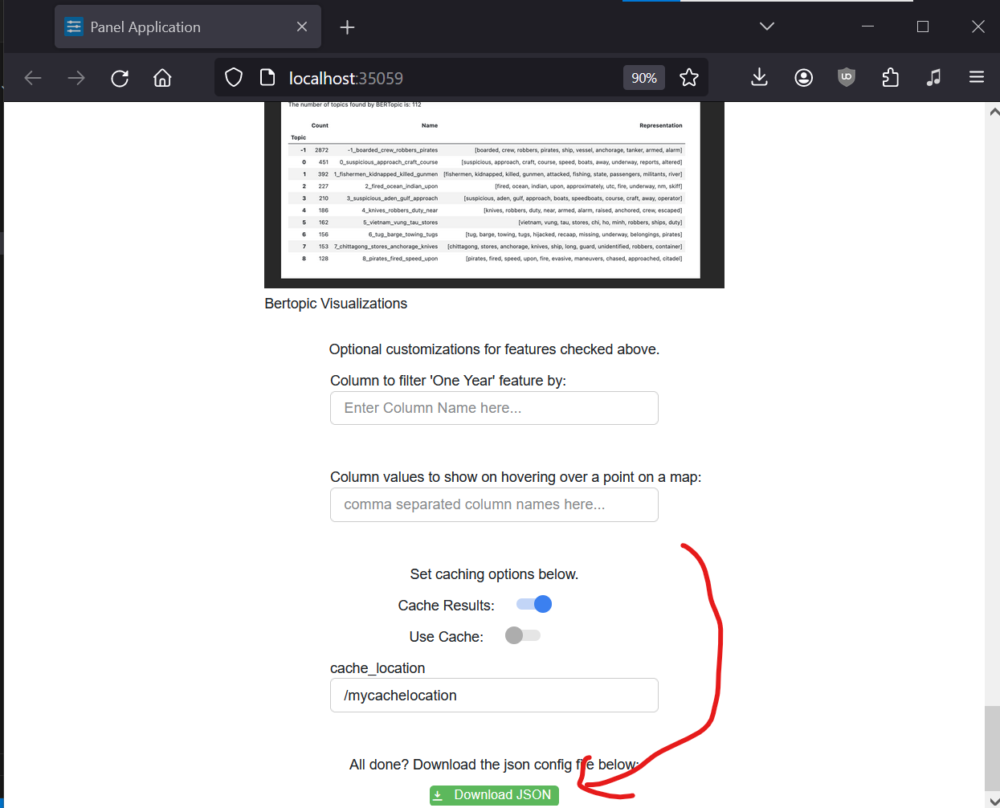

Getting Started
===================================

Getting your data
------------------

First things first, make sure your data is in a **.csv** format! 
We may handle other file formats in the future, but for now stick with .csv files. The csv data should be row-based, meaning each data point is one row (not column).

For most tools GeoViz provides, you'll need (at least) columns representing:

* Latitude (floats between -90 and 90)
* Longitude (floats between -180 and 180)
* Dates (in a format parseable with pandas' `parse_date functionality <https://pandas.pydata.org/pandas-docs/stable/reference/api/pandas.read_csv.html/>`_.)

If you want to follow along, download a dataset of pirate attacks here: `clean_asam.csv <https://github.com/rrc-byu/ds-capstone-2023-2024/blob/main/tests/data_files/clean_asam.csv>`_

Setting options
----------------

Next, we'll need to select what components we want to see, as well as tell GeoViz which columns are our latitude/longitude/date columns.
Luckily, as of release `0.1.2 <https://github.com/rrc-byu/ds-capstone-2023-2024/releases/tag/v0.1.2>`_
We don't need to deal with writing a JSON file at all! Before anything, install python via pip:

.. code-block:: bash

    pip install rrcgeoviz --upgrade

Now, run the init command:

.. code-block:: bash

    rrcgeoviz --init

You should see a new tab in your browser that looks like this:

First things first, let's tell GeoViz which columns are which. Take a look at your data and add the relevant column names:

For now, all columns are required.
Now, scroll down to the features section. We have a whole lot to look at! Try check a couple that look interesting:

For right now, the init page is incorrect: The feature customizations are required, and the hover columns are space separated and not comma separated. Here's what it should look like:

.. image:: features_customizations.png
    :scale: 75 %
    :align: center

If you selected some compute-heavy options, e.g. the NLP clustering, you might want to use caching. Try toggling the "Cache Results" one
and putting a path where you want to store your data:

.. note::

   Set the path relative to where you're running. For example, if your command line is at C:/users/myuser, then putting in "./geoviz" would
   store the data at C:/users/myuser/geoviz.

We're all set! Go ahead and click that green download button:

You should see a JSON file download from your browser. Store it somewhere accessible from the command line.
To see what a complete options file looks like, check out the one at `rrcgeoviz/options_tests/devoptions.json <https://github.com/rrc-byu/ds-capstone-2023-2024/blob/major_refactor/tests/options_files/devoptions.json>`_.
If you're interesting in writing it by hand (not recommended) check out the :doc:`making_config` page.

Installing & Running GeoViz
----------------------------

That's it for setup, now let's actually see what GeoViz can do. With geoviz already installed, run it with the command line:

.. code-block:: bash
    
    rrcgeoviz relative/path/to/mydata.csv relative/path/to/myoptions.json

Make sure that the paths to the data and options are relative to the directory you're calling rrcgeoviz from.

A tab should open in your default browser with GeoViz running! 

Check some of the boxes to see the features. You may also be interested in the modifying dataframe tab:

You can save your changes, as well as download a pandas profiling of your data, in the "Downloadables" tab:

Once you're done, stop the GeoViz server with `Ctrl+C` in the terminal.

What to do now
----------------

Congratulations! You're now a semi-expert on how to use GeoViz. 
If you want a complete look at all the features, check out the :doc:`features` page. 
Note the required columns and be sure to add them at the top of the init page!